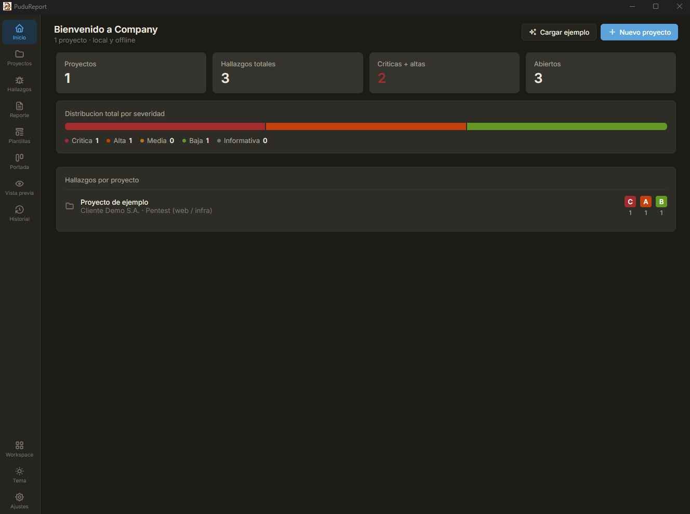
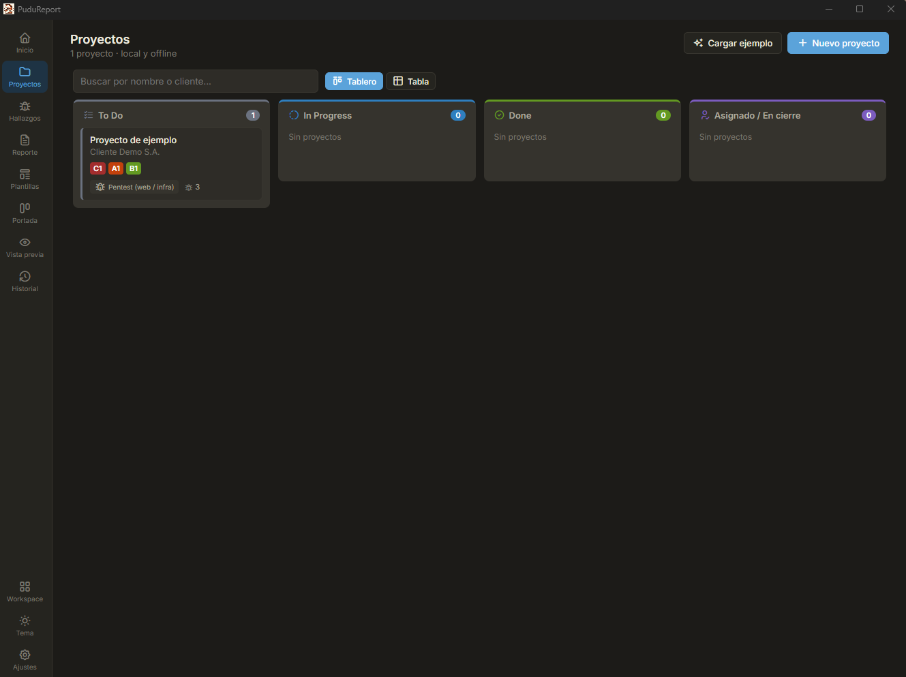
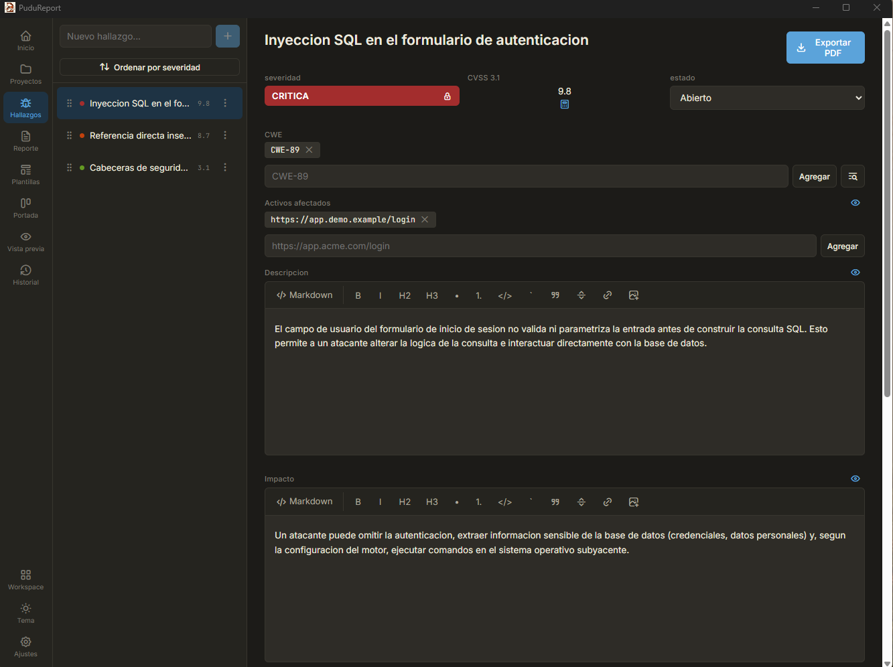
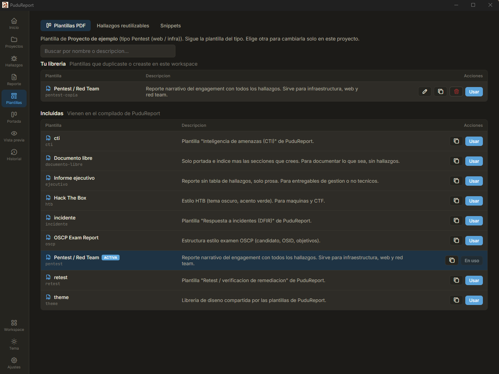
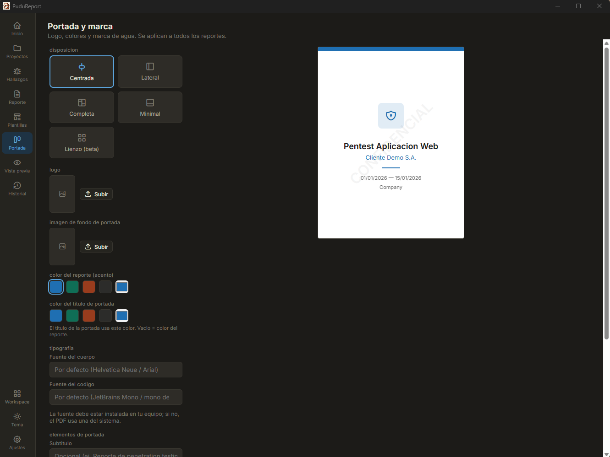
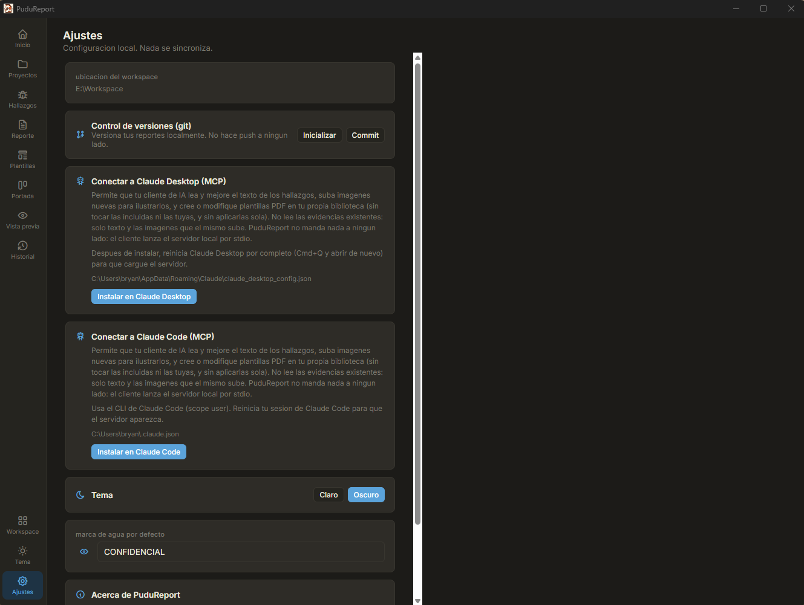

<p align="center">
  
</p>

# PuduReport

<p align="center">
  <a href="https://github.com/bc0d3/PuduReport/releases"></a>
  <a href="https://github.com/bc0d3/PuduReport/actions/workflows/ci.yml"></a>
  <a href="LICENSE"></a>
  
  <a href="https://ko-fi.com/bc0d3"></a>
</p>

<p align="center"><sub>Rama <code>main</code>: version estable (produccion). El desarrollo ocurre en <code>dev</code>.</sub></p>

Aplicacion de escritorio local-first para redactar reportes de vulnerabilidades y generar PDF profesionales. Pensada para pentesters y bug hunters. Funciona offline, sin servidor y sin que los datos salgan de tu equipo.

<p align="center">
  
</p>
<p align="center"><sub>Panel de inicio: proyectos, hallazgos y distribucion por severidad de un vistazo.</sub></p>

## Caracteristicas

- Editor de hallazgos tipo formulario: campos estructurados (severidad, CVSS, estado, CWE) y bloques markdown que se llenan pegando contenido.
- Calculadora CVSS 3.1 y 4.0 integrada. La severidad se deriva del vector.
- Libreria de plantillas: hallazgos y snippets reutilizables con variables.
- Generacion de PDF con plantillas personalizables: portada con tu logo y colores, marca de agua, secciones activables.
- Workspaces locales en la carpeta que elijas. Cada workspace es git-friendly (solo texto + assets).
- Multiplataforma: macOS, Windows y Linux.

## Capturas

<p align="center">
  
</p>
<p align="center"><sub>Tablero de proyectos estilo kanban (To Do, In Progress, Done, En cierre) o vista de tabla.</sub></p>

<p align="center">
  
</p>
<p align="center"><sub>Editor de hallazgos: campos estructurados (severidad, CVSS, CWE, estado) y bloques markdown. La severidad se deriva del vector CVSS.</sub></p>

<p align="center">
  
</p>
<p align="center"><sub>Libreria de plantillas: PDF por tipo de reporte (Pentest, OSCP, HTB, ejecutivo, CTI, DFIR, retest), hallazgos reutilizables y snippets.</sub></p>

<p align="center">
  
</p>
<p align="center"><sub>Portada y marca: disposiciones predefinidas, logo, colores, tipografia y marca de agua, con vista previa en vivo.</sub></p>

<p align="center">
  
</p>
<p align="center"><sub>Ajustes locales: control de versiones git y conexion opcional a tu cliente de IA (MCP) para Claude Desktop o Claude Code. Nada se sincroniza.</sub></p>

## Stack

- Tauri v2 (Rust + React/TypeScript)
- Typst como motor de PDF
- SQLite (solo indice de busqueda)

## Desarrollo

Guia completa de arquitectura, setup y contribucion en [README.dev.md](README.dev.md).

Requisitos: Node.js 20+, Rust estable, y las dependencias de Tauri para tu sistema.

PuduReport empaqueta el binario de Typst como sidecar de Tauri. Antes de
`dev` o `build`, coloca el binario en `src-tauri/binaries/` con el sufijo del
target triple de tu plataforma (por ejemplo `typst-aarch64-apple-darwin`).
Para desarrollo basta tener `typst` en el PATH: el backend lo resuelve por
variable de entorno `PUDU_TYPST_BIN`, sidecar junto al ejecutable, o PATH.

```bash
npm install
npm run tauri dev
```

Build de produccion:

```bash
npm run tauri build
```

Tests del backend (CVSS 3.1/4.0, parseo de front-matter, pipeline de PDF):

```bash
cd src-tauri && cargo test
```

El workspace por defecto se ubica donde tu lo elijas (file picker); sugerencia
`~/Documents/PuduReport/`. Cada workspace es una carpeta de texto + assets,
apta para versionar con git.

## Privacidad

Sin telemetria. Sin llamadas de red salvo la verificacion de actualizaciones. Los reportes nunca salen de tu equipo.

## Seguridad

Encontraste una vulnerabilidad en PuduReport? Reportala de forma responsable por el
canal privado de GitHub (pestania **Security** > **Report a vulnerability**), no en un
issue publico. Detalle, alcance y agradecimientos en [SECURITY.md](SECURITY.md).

Reconocemos publicamente a quien reporte (Hall of Fame). Gracias por ayudar.

## Aviso

PuduReport es una herramienta gratuita y de codigo abierto, provista "tal cual" (as is), sin garantia de ningun tipo, segun la licencia GPL-3.0 (ver secciones 15 y 16 de LICENSE).

El usuario es el unico responsable del uso que le da a la herramienta, del contenido que ingresa y de los reportes que genera. PuduReport esta pensada para documentar pruebas de seguridad autorizadas; cualquier uso fuera de ese marco es responsabilidad exclusiva de quien la utiliza. Los autores no se responsabilizan por danos ni uso indebido.

## Apoyar el proyecto

PuduReport es gratuito y de codigo abierto (GPL-3.0), desarrollado en tiempo libre. Si te resulta util y quieres ayudar a sostener el desarrollo, puedes invitarme un cafe. Es totalmente opcional y se agradece mucho.

<div align="center">

[](https://ko-fi.com/R4W421O9QC)

</div>

## Licencia

GPL-3.0. Ver LICENSE.